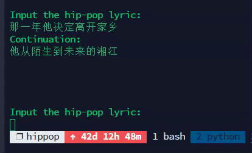

# HippopTransformer for Chinese Hip-pop Generation

<p align="center">
  
</p>

Project for PKU [Deep Generative Models 2021 spring](https://deep-generative-models.github.io/).

Achieve Chinese Hip-pop Generation with (1) [LSTM](https://dl.acm.org/doi/10.1162/neco.1997.9.8.1735), (2) [Vanilla Transformer](https://arxiv.org/abs/1706.03762), (3) Vanilla Transformer with [RL](https://www.aclweb.org/anthology/P19-1193/) and (4) [Transformer-GAN](https://assets.amazon.science/36/e6/95f355a24df983dfcd2fe6b5ad2a/symbolic-music-generation-with-transformer-gans.pdf). 
All implements are based on [fairseq](https://github.com/pytorch/fairseq).

## Introduction

### Dataset
The [lyric data](data/origin_lyric) is crawled from [Netease Cloud Music](https://music.163.com).
The data is first segmented with [jieba](https://github.com/fxsjy/jieba), then is preprocessed in to sentence pair format. 

The statistics of the datasets:

| Dataset | # Pair | Avg Length (src/tgt) | Max Length (src/tgt) |
| ----------- | ---------- | ------------------ | ------------------ |
| Train       | 86,906    |    13.64 / 13.66   |       78 / 81      |
| Dev         | 4,828     |    13.79 / 13.71   |      77 / 48      |
| Test        | 4,828     |   13.77 / 13.67    |      83 / 68     |

## Prepare environment

```
conda create -n hippop python=3.6
conda activate hippop
conda install pytorch torchvision cudatoolkit=10.0 -c https://mirrors.tuna.tsinghua.edu.cn/anaconda/cloud/pytorch
pip install -r requirements.txt 
```

## Process data

```
bash scripts/prepare-lyric.sh
sh scripts/process.sh
python data/generate_rhyme_table.py
```

## Interactive Demo
1. Process the data.

2. Download one of the pre-trained checkpoints from [releases link](https://github.com/RenShuhuai-Andy/HippopTransformer/releases/tag/v0.1):
    ```bash
    mkdir checkpoints
    wget -P checkpoints/ https://github.com/RenShuhuai-Andy/HippopTransformer/releases/download/v0.1/transformer_base_rl_checkpoint_best.pt
    ```

3. Run the demo:

    ```bash
    python local_demo.py \
        --checkpoint_dict checkpoints/ \
        --checkpoint_file transformer_base_rl_checkpoint_best.pt
    ```

<p align="center">
  
</p>

## Train

```
sh scripts/train_transformer.sh
```

## Evaluation

```
sh scripts/evaluate.sh -m transformer_base -c 0 -n 10
```
- `-m` denotes the model architecture.
- `-c` denotes the index of CUDA device.
- `-n` denotes the number of checkpoints for average.

## Model Architecture
|Model Architecture| LSTM | Transformer-Base | Transformer-Large|
| --------------------- | ---- | ---- | ---- |
|Encoder Embedding Size | 256 | 512 |512|
|Encoder Feed-forward Size | 512 | 1024| 2048|
|Encoder Attention Head Size | - |4| 8|
|Encoder Layer Number | 1 | 4| 6|
|Decoder Embedding Size | 256 | 512| 512|
|Decoder Feed-forward Size | 512 | 1024 |2048|
|Decoder Attention Head Size | - | 4 |8|
|Decoder Layer Number | 1 | 4 |6|

## Result

|                       | BLEU | Rhyme Rate |
| --------------------- | ---- | ---- |
| lstm | 11.78, 18.1/11.3/10.2/9.2 | 0.1375 |
| + average checkpoints| 13.12, 19.4/12.5/11.5/10.6 | 0.1433 |
| transformer_base | 13.56, 18.6/13.8/12.9/12.0 | 0.2129 |
| + average checkpoints| 13.71, 19.1/13.3/12.3/11.3 | 0.2270 |
| transformer_base_rl | **14.22**, 19.3/14.3/13.4/12.6 | 0.2171 |
| + average checkpoints| 12.79, 19.1/12.5/11.1/10.1 | **0.2336** |
